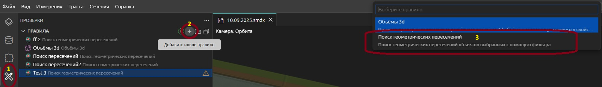
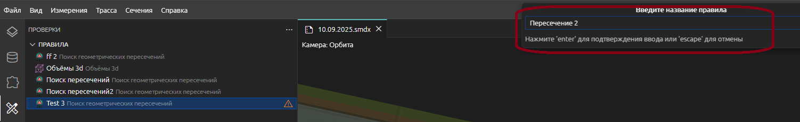
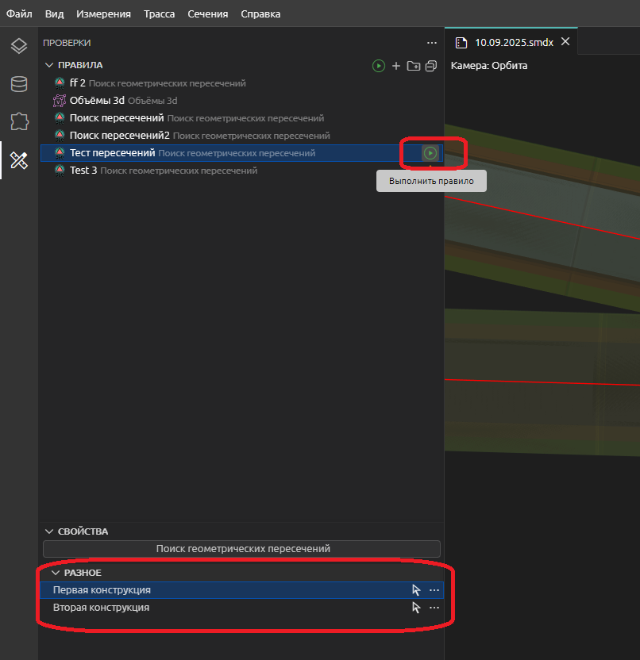
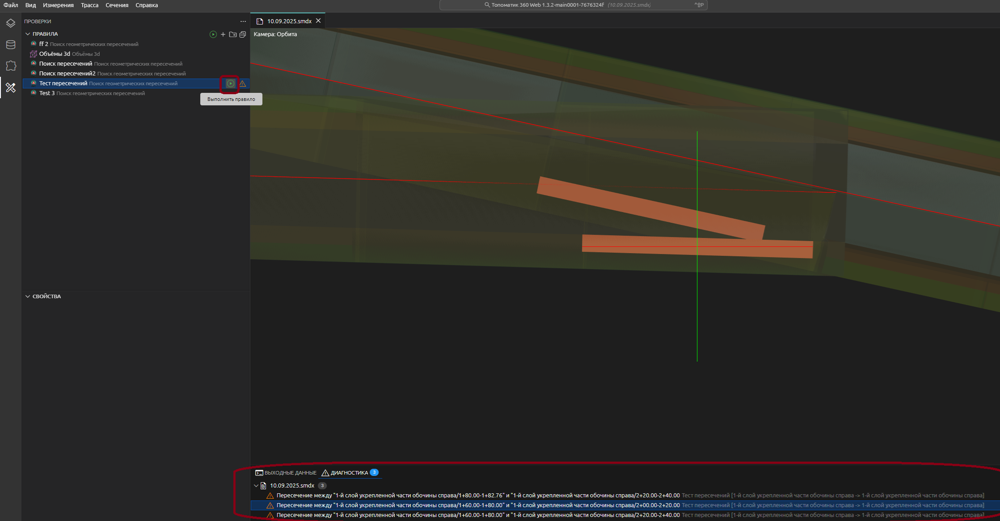

# Геометрические коллизии

Плагин предназначен для диагностики моделей в среде **Топоматик 360**.
Он автоматически ищет пересечения между элементами 3D-моделей и
помогает пользователю локализовать коллизии.

------------------------------------------------------------------------

## Назначение

-   Анализ моделей на наличие геометрических пересечений;
-   Вывод списка проблемных объектов;
-   Подсветка пересечений непосредственно в окне модели;
-   Упрощение проверки коллизий при проектировании.

------------------------------------------------------------------------

## Установка

[Установить плагин](https://360.topomatic.ru/?extensionInstallPath=https%3A%2F%2Ffangarh.github.io%2FRoburIntercept%2F)


------------------------------------------------------------------------

## Работа с исходным кодом

### Установка зависимостей

```
npm install
```

### Сборка

```
npm run build
```

### Отладка

```
npm run serve
```

------------------------------------------------------------------------

## Использование



* Откройте боковую панель диагностики (на картинке `1`)
* Нажмите кнопку `+` в верхнем меню панели (на картинке `2`) - откроется меню с выбором правила.
* Выберите правило `Поиск геометрических пересечений`  (на картинке `3`)



* Введите название правила



* Введите фильры поиска
* Нажмите кнопку начала диагностики
* В нижней панеле диагностика появится список пересечений объектов полученных по фильтру.




------------------------------------------------------------------------

## Поддержка

Если вы нашли ошибку или хотите предложить улучшение:
- создайте issue на GitHub;
